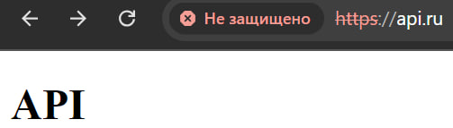
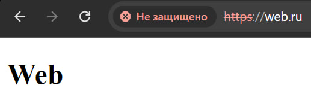

# Лабораторная работа 1

## Задание

### Настроить nginx по заданному тз:
1. Должен работать по https c сертификатом
2. Настроить принудительное перенаправление HTTP-запросов (порт 80) на HTTPS (порт 443) для обеспечения безопасного соединения.
3. Использовать alias для создания псевдонимов путей к файлам или каталогам на сервере.
4. Настроить виртуальные хосты для обслуживания нескольких доменных имен на одном сервере.
5. Что угодно еще под требования проекта

## Процесс выполнения работы

### Установка Nginx

1. Nginx был установлен при помощи apt:

```
apt install nginx
```

### Настройка SSL для HTTPS

1. Для использования HTTPS необходимо наличие SSL-сертификата. Для генерации SSL-сертификата использовалась библиотека OpenSSL:

```
openssl req -newkey rsa:2048 -nodes -keyout ca.key -x509 -days 3654 -out ca.crt
```

2. Затем сгенерированные ключ и сертификат были указаны в конфиге Nginx:

```
ssl_certificate /etc/nginx/ssl/ca.crt;
ssl_certificate_key /etc/nginx/ssl/ca.key;
```

### Настройка редиректа с HTTP на HTTPS

1. Редирект был настроен в конфиге ```sites-available/default```:

```
/etc/nginx ❯ cat sites-available/default                                                                                                    
server {
    listen 80 default_server;

    server_name _;

    return 301 https://$host$request_uri;
}
```

### Настройка доступа к файлам и каталогам сервера

1. Для доступа использовались директивы ```root``` и ```alias```, которые при обработке блока ```location / {...}``` дают один и тот же результат:

```
root /etc/nginx/html/;

alias /etc/nginx/html/;
```

### Настройка виртульных хостов

1. Виртуальные хосты были настроены в конфигах ```sites-enabled/api.ru.conf``` и ```sites-enabled/web.ru.conf```

```
/etc/nginx ❯ ls sites-available                                                                                                         
api.ru.conf  default  web.ru.conf
```

2. Затем для обработки виртуальных хостов средствами Nginx были созданы символические ссылки на конфиги в папке ```sites-enabled```

```
sudo ln -s /etc/nginx/sites-available/api.ru.conf /etc/nginx/sites-enabled/api.ru.conf
sudo ln -s /etc/nginx/sites-available/web.ru.conf /etc/nginx/sites-enabled/web.ru.conf
```

## Тестирование выполненной работы

В файл hosts были добавлены настройки локального DNS после чего при переходе на ранее настроенные доменные имена можно увидеть HTML-страницы:



