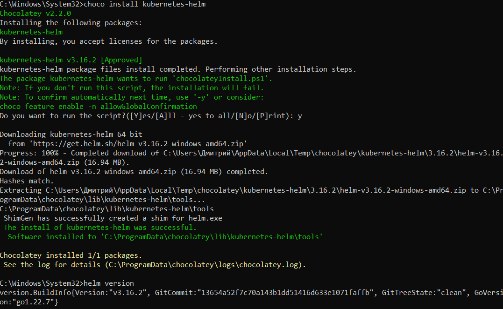
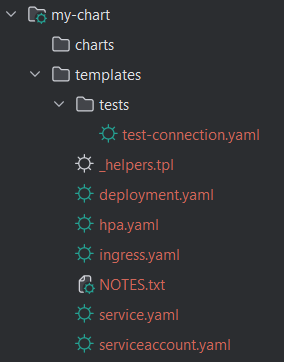
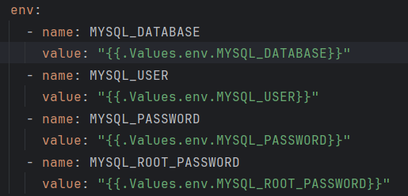
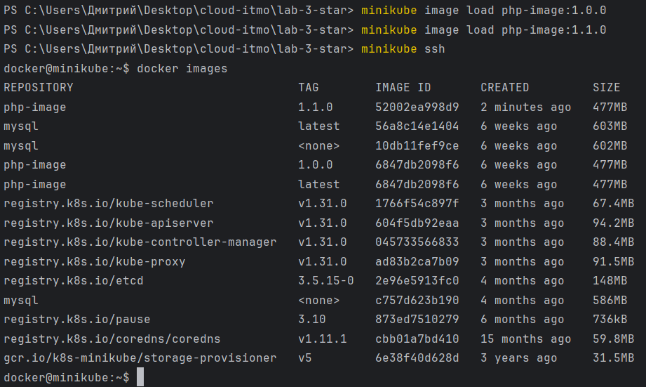
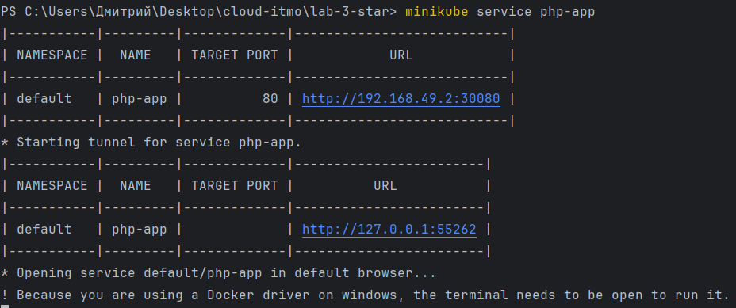
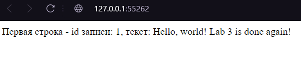
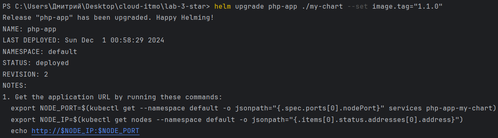
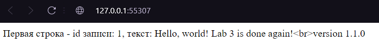

# Установка helm

Перед началом работы был установлен необходимый нам инструмент




# Создание чарта

С помощью команды `helm create my-chart` был сгенерирован шаблон



В файле [values.yaml](./my-chart/values.yaml) были изменены некоторые параметры в соответствии с параметрами сервисов из 3 лабы:
```yaml
image.repository: php-app
service.type: NodePort
```

Сюда же были вынесены переменные окружения, которые позже будут подтянуты при деплое сервисов:
```yaml
env:
  MYSQL_DATABASE: "cloud_lab3"
  MYSQL_USER: "dshevelev"
  MYSQL_PASSWORD: "1234"
  MYSQL_ROOT_PASSWORD: "0000"
```

Также в файле [deployment.yaml](./my-chart/templates/deployment.yaml) в `spec.template.spec.containers` был добавлен массив env: переменные окружения подтягиваются из values.yaml:



Дальше были созданы две версии одного и того же образа, после чего были запушены в minikube:




# Запуск первой версии приложения и обновление


Сервис был запущен



Было проверено, что это нужная версия приложения



Затем чарт был обновлен до версии 1.1.0



Как можно заметить, обновленная версия имеет некоторые изменения

