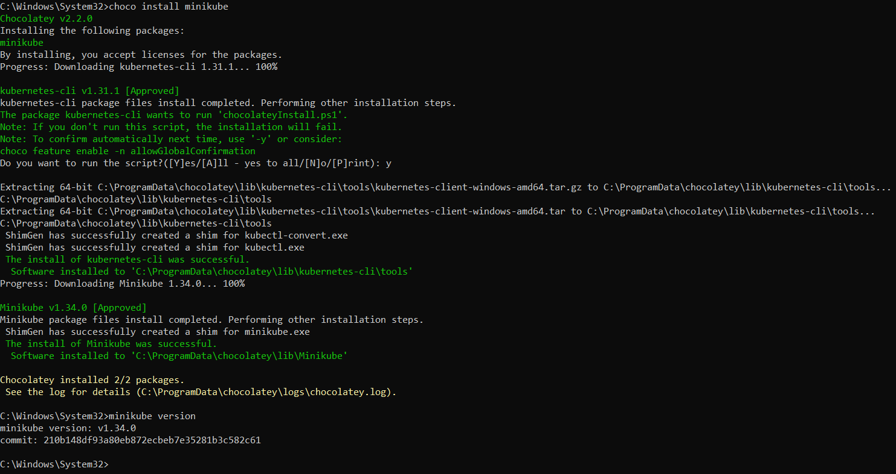
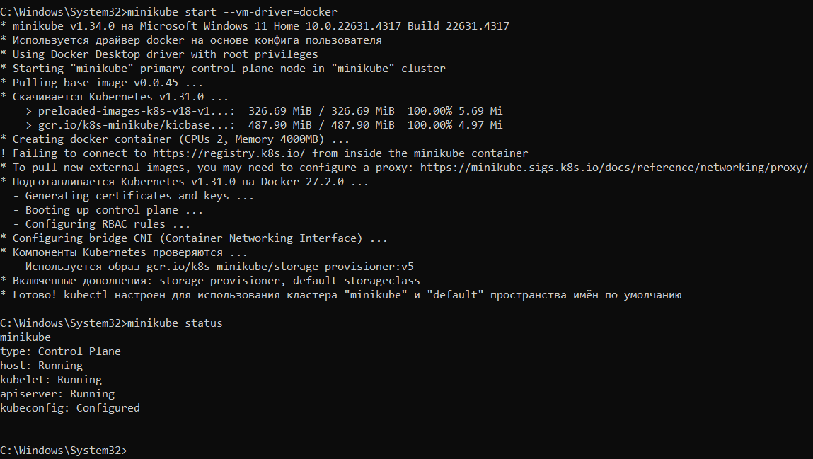
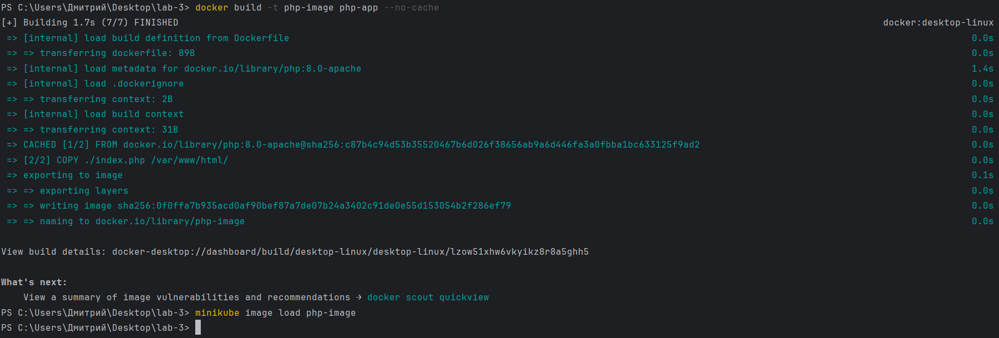
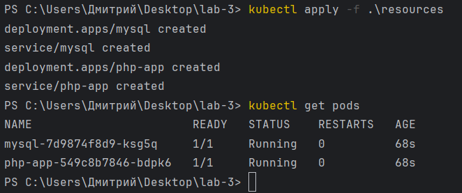
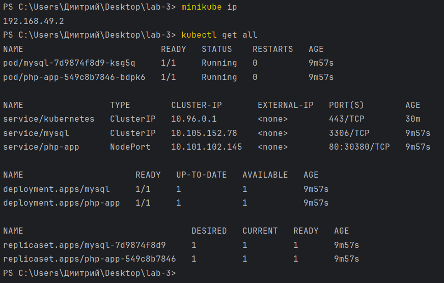
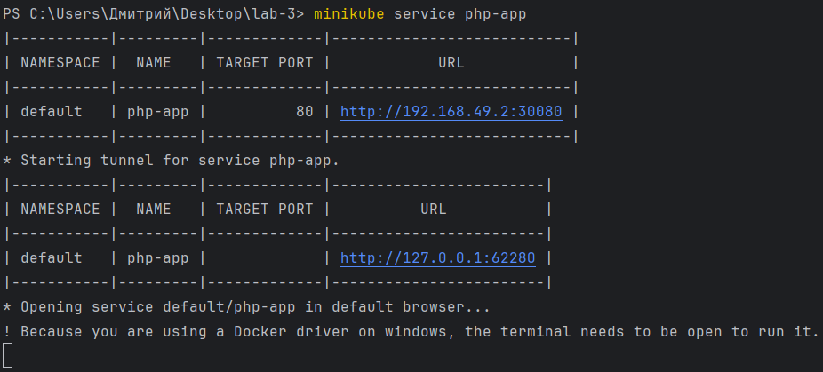

# Лабораторная работа №3

## Установка minikube

Установка происходила по [инструкции с официального сайта](https://kubernetes.io/ru/docs/tasks/tools/install-minikube/). 

Гипервизор и kubectl оказались уже установлены на ПК: насколько я понял, они были поставлены в комплекте с Docker Desktop.

Поэтому переходим непосредственно к установке minikube.

Далее можно запускать minikube. Из предложеннных драйверов был выбран HyperV как один из рекомендованных для Windows.

Успех!

## Подготовка приложения

Для начала был написан небольшой [PHP-файл](php-app/index.php), который подключается к БД MySQL, берет данные из таблицы test и выводит их на экран.

Затем для нашего импровизированного мини-приложения был написан [Dockerfile](php-app/Dockerfile), чтобы можно было собрать docker-образ (названный здесь как php-image) этого приложения.

Дальше этот образ нужно пробросить в minikube. Это делается для того, чтобы minikube имел возможность увидеть образ приложения и запустить его как поду.

(образ билдится с --no-cache на всякий случай, потому что это не первая сборка)

## Создание YAML файлов для сервисов

Итак, нам нужно два сервиса: MySQL и непосредственно приложение.

1. MySQL ([конфиг](resources/mysql.yaml))

Берем образ из интернета, приложение называем mysql, добавляем переменные окружения для корректной работы. Ставим стандартный порт 3306.

2. Приложение ([конфиг](resources/service.yaml))

Берем образ нашего приложения, называем сервис php-app, выставляем порт 80. Особенности: чтобы minikube мог найти локальный образ, нужно выставить политику IfNotPresent. Также чтобы порт был виден извне (не только внутри кластера), нужно для сервиса выставить тип NodePort.

## Запуск сервисов

Вызываем запуск наших файлов и проверяем, что они запущены.

Поды запущены! Осталось проверить, что всё действительно работает.

Шаманскими махинациями (ручное подключение к поде) в MySQL в БД cloud_lab3 была создана таблица test с одной записью.

Дальше выясняем IP-адрес minikube и порт, на котором запущено наше приложение.

Получается, идем на 192.168.49.2:30380 и радуемся жизни. Но не все так просто: по какой-то неведомой причине (мне так и не удалось узнать почему) minikube с драйвером докера не хочет пускать меня по такому адресу. Поэтому был запущен туннель, который пустил меня на мой сайт.

