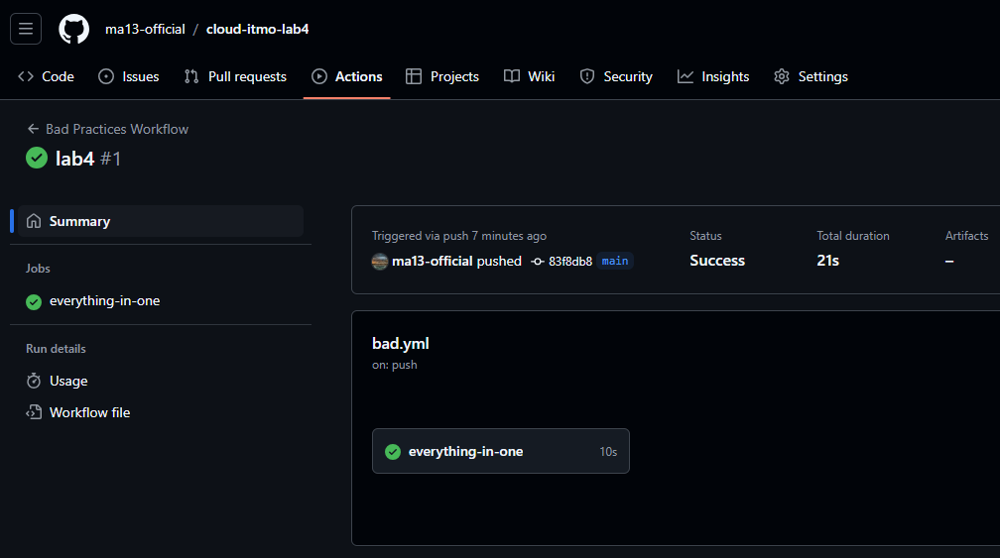
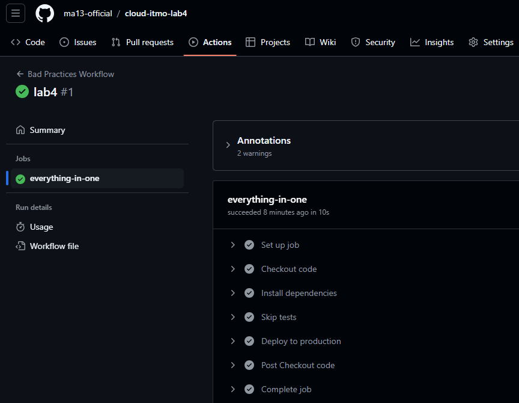
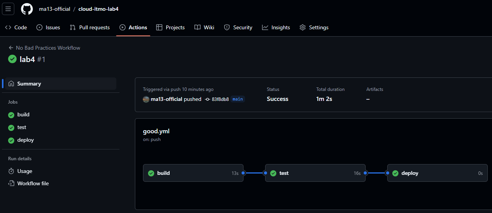
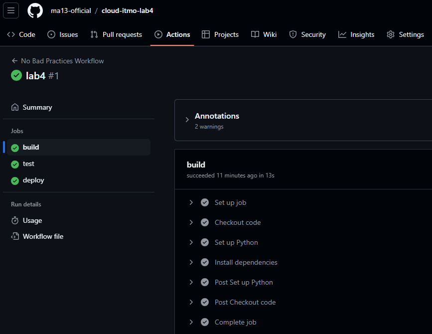
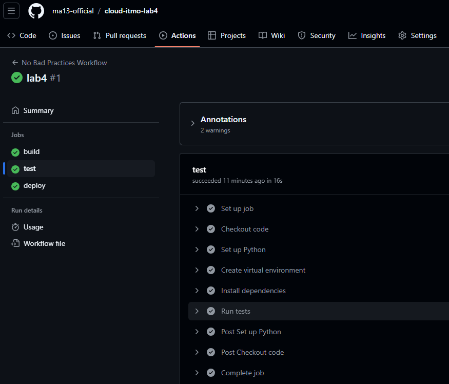
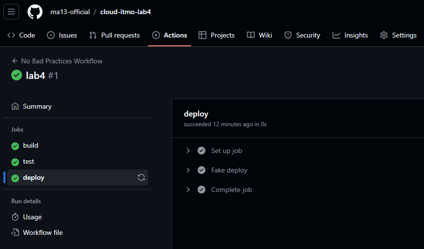

# Лабораторная работа

В рамках лабораторной работы необходимо описать ключевые различия между рабочими процессами с плохими и хорошими практиками для пайплайнов CI/CD  
Для примера был выбран простой Python(FastAPI) - проект

Работы выполнялась в [отдельном репозитории](https://github.com/ma13-official/cloud-itmo-lab4/actions/)

## Workflow с bad practices

```yaml
name: Bad Practices Workflow

on:
  push:
    branches:
      - "*"

jobs:
  everything-in-one:
    runs-on: ubuntu-latest

    steps:
      - name: Checkout code
        uses: actions/checkout@v2

      - name: Install dependencies
        run: |
          pip install -r test_app/requirements.txt

      - name: Skip tests
        run: echo "Skipping tests"

      - name: Deploy to production
        run: echo "Deploying..."

```

### Тестирование данного workflow

Пайп был запущен 



Также можно посмотреть шаги выполнения единственной джобы:



### Проблемы:
1. **Запуск на всех ветках**: Увеличивает нагрузку и риски, поскольку код, не завершённый или экспериментальный, может быть задеплоен.
2. **Плохое именование этапов**: Использование общих имен, таких как `everything-in-one`, затрудняет понимание логики пайплайна.
3. **Отсутствие разделения на build, test и deploy**: Смешивание всех этапов в одном джобе усложняет отладку.
4. **Неявное указание версии Python**: Это может привести к проблемам совместимости при изменении версии Python.
5. **Пропуск тестов**: Это повышает вероятность доставки багов.

---

## Workflow без bad practices

Workflow без bad practices разделяет этапы, учитывает безопасность и использует явное управление версиями:

```yaml
name: No Bad Practices Workflow

on:
  push:
    branches:
      - main

env:
  PYTHON_VERSION: '3.10'
  VENV_DIR: '.venv'
  REQUIREMENTS_PATH: 'test_app/requirements.txt'

jobs:
  build:
    runs-on: ubuntu-latest
    steps:
      - name: Checkout code
        uses: actions/checkout@v2

      - name: Set up Python
        uses: actions/setup-python@v4
        with:
          python-version: ${{ env.PYTHON_VERSION }}

      - name: Install dependencies
        run: |
          python -m venv ${{ env.VENV_DIR }}
          source ${{ env.VENV_DIR }}/bin/activate
          python -m pip install --upgrade pip
          pip install -r ${{ env.REQUIREMENTS_PATH }}

  test:
    runs-on: ubuntu-latest
    needs: build
    steps:
      - name: Checkout code
        uses: actions/checkout@v2

      - name: Set up Python
        uses: actions/setup-python@v4
        with:
          python-version: ${{ env.PYTHON_VERSION }}

      - name: Create virtual environment
        run: |
          python -m venv ${{ env.VENV_DIR }}
          source ${{ env.VENV_DIR }}/bin/activate

      - name: Install dependencies
        run: |
          source ${{ env.VENV_DIR }}/bin/activate
          python -m pip install --upgrade pip
          pip install -r ${{ env.REQUIREMENTS_PATH }}

      - name: Run tests
        run: |
          source ${{ env.VENV_DIR }}/bin/activate
          pytest

  deploy:
    runs-on: ubuntu-latest
    needs: test
    steps:
      - name: Fake deploy
        run: |
          echo "Deploy..."
          echo "Code has been tested and passed all checks."
          echo "Deployment simulation successful."

```

### Тестирование данного workflow

Пайп был запущен



Можно посмотреть каждую из джоб отдельно:

###### build


###### test


###### deploy


### Улучшения:
1. **Запуск только на основной ветке**: Это уменьшает нагрузку и снижает риски деплоя незавершённого кода.
2. **Логичные имена этапов**: Этапы теперь логически названы как `build`, `test` и `deploy`, что улучшает понимание пайплайна.
3. **Чёткое разделение на этапы**: Пайплайн разделён на отдельные джобы для сборки, тестирования и деплоя, что облегчает поддержку.
4. **Явное указание версии Python**: Указана версия Python (`3.10`), что обеспечивает стабильность среды.
5. **Добавлен этап тестирования**: Теперь пайплайн включает этап тестирования с использованием `pytest`, что позволяет рано выявить ошибки.

## Заключение

Следование хорошим практикам позволяет сделать пайплайн более надёжным, безопасным и удобным для поддержания.  
Эти улучшения обеспечивают стабильность работы, уменьшают риски и повышают читаемость.