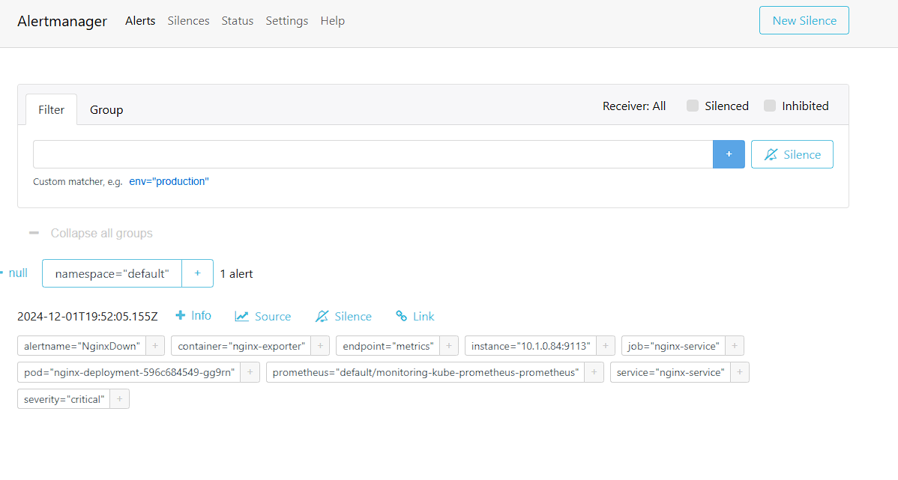
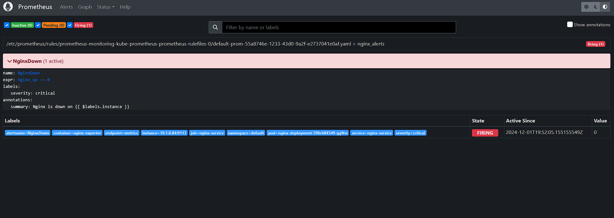

# Лабораторная 5*


## Цель работы:
Настроить алерт кодом IaaC (например через конфиг алертменеджера, главное - не в интерфейсе графаны:), показать пример его срабатывания. Попробовать сделать так, чтобы он приходил, например, на почту или в телеграм. Если не получится - показать имеющийся результат и аргументировать, почему дальше невозможно реализовать.

## Ход работы

Поскольку был использован чарт kube-prometheus-stack было необходимо настроить prometheus и alert manager таким образом, чтобы можно было создать новый alert и отправить его в ТГ.

Для этого был использован файл values.yaml

```
prometheus:
  prometheusSpec:
    serviceMonitorSelectorNilUsesHelmValues: false
    serviceMonitorSelector: {}
    serviceMonitorNamespaceSelector: {}
    ruleSelector:
       matchExpressions:
        - key: prometheus
          operator: In
          values:
          - example-rules
grafana:
  sidecar:
    datasources:
      defaultDatasourceEnabled: true

alertmanager:
  config:
    global:
      resolve_timeout: 5m
      telegram_api_url: "https://api.telegram.org"

    route:
      receiver: telegram-bot

    receivers:
      - name: telegram-bot
        telegram_configs:
          - chat_id: <chatID>
            bot_token: <tocken>
            api_url: "https://api.telegram.org"
            send_resolved: true
            parse_mode: Markdown
```

После этого апгрейдим helm:

```
helm upgrade monitoring prometheus-community/kube-prometheus-stack --values values.yaml
```
Все сработало, теперь у нас есть пустой алерт менеджер, который отправляет данные в нашего ТГ бота.

Затем было необходимо создать новый алерт:

```
apiVersion: monitoring.coreos.com/v1
kind: PrometheusRule
metadata:
  labels:
    prometheus: example-rules
    role: alert-rules
  name: prom
spec:
  groups:
      - name: nginx_alerts
        rules:
          - alert: NginxDown
            expr: nginx_up == 0
            for: 0m
            labels:
              severity: critical
            annotations:
              summary: "Nginx is down on {{ $labels.instance }}"
```

Это создаст новый PrometheusRule, который будет алертом. 

Новый алерт можно увидеть в Alert manager.

Пробросим порты:

```
kubectl port-forward <alert-manager> 9093:9093
```

Alert:



Осталось проверить будет ли оно работать. Выключим nginx.

Проверка работы:



Как мы видим, правило работает и, если nginx не работает, то все срабатывает.

*Однако!*
В силу неведомых мне обстоятельст, сообщение на бота в ТГ не приходит. Пофиксить это не получилось, я много раз перепроверил API токен, работу бота в целом и так далее, но по какой-то причине сообщение о алерте не присылается. В связи с чем, реализация отправки алерта не была проведена успешно(.

## Выводы

В ходе выполнения работы был создан алерт с помощью конфигов. Была проверена работоспособность алерта. Работа не была реализована в полном объеме, так как отправка сообщений в ТГ бота не была сделана.


