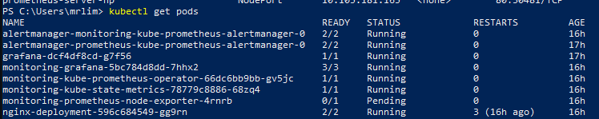
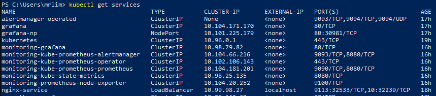
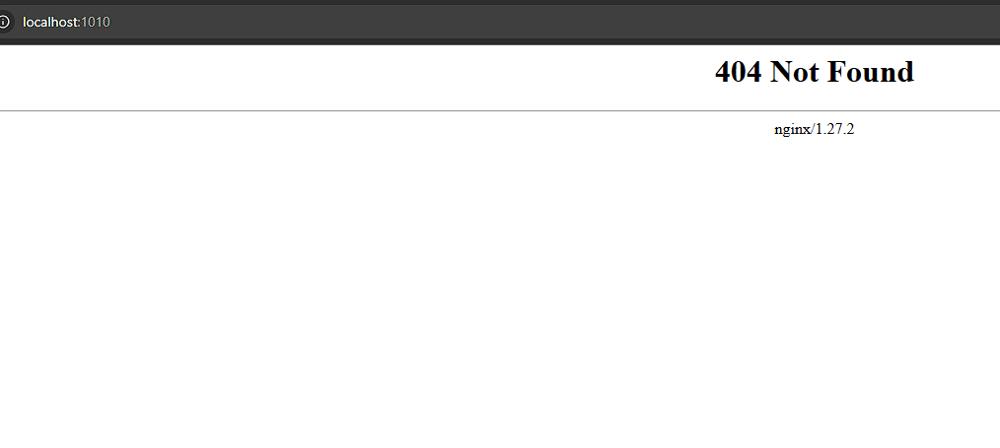
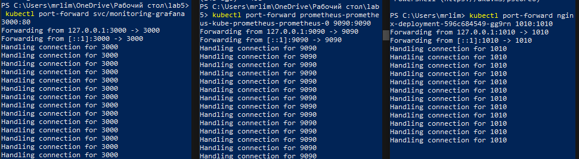
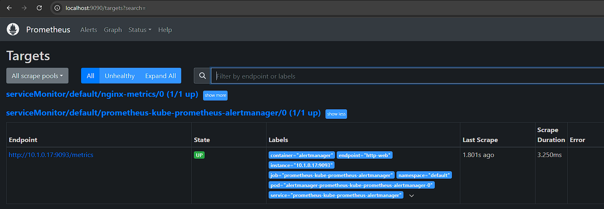
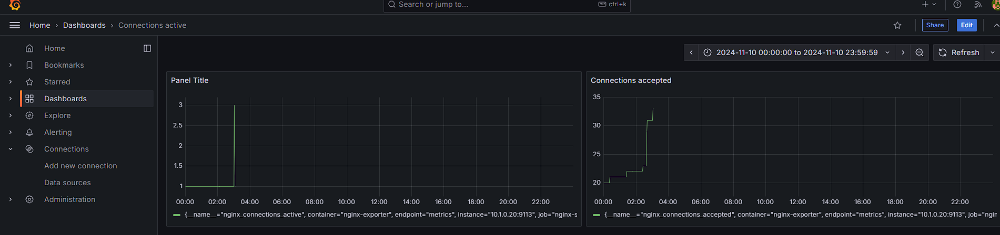

# Лабораторная 5


## Цель работы:
Сделать мониторинг сервиса, поднятого в кубере (использовать, например, prometheus и grafana). Показать хотя бы два рабочих графика, которые будут отражать состояние системы. Приложить скриншоты всего процесса настройки.

## Ход работы

Для выполнения работы было принято решение развернуть nginx и мониторить его.
kubectl был установлен вместе с Docker Desktop, поэтому проблем не возникло.
### Глава 1 - Nginx и Nginx-exporter

Был написан deplyment и service для nginx и nginx-exporter:

```
apiVersion: apps/v1
kind: Deployment
metadata:
 name: nginx-deployment
 labels:
   app: nginx
spec:
 replicas: 1
 selector:
   matchLabels:
     app: nginx
 template:
   metadata:
    labels:
      app: nginx
   spec:
     containers:
     - name: nginx
       image: nginx:latest
       ports:
       - name: http
         containerPort: 10
     - name: nginx-exporter
       image: nginx/nginx-prometheus-exporter:latest
       args:
         - --nginx.scrape-uri=http://127.0.0.1:1010/metrics
       ports:
        - name: metrics
          containerPort: 9113
---
apiVersion: v1
kind: Service
metadata:
 name: nginx-service
 labels:
   app: nginx
spec:
 type: LoadBalancer
 selector:
   app: nginx
 ports:
   - name: metrics
     port: 9113
     targetPort: 9113
   - name: http
     port: 10
     targetPort: 10
     protocol: TCP
```
*Почему же были выбраны порт 10, вместо дефолтного 80?* Изначально все так и было, но впоследствии выяснилось на порту 80 что-то стало функционировать (graphana) и я не мог обратиться к nginx, поэтому порт был изменен в ходе выполнения лабораторной.

После этого применяем манифест:

```
kubectl apply -f <manifest.yaml>
```
И все сработало. Поднялся POD nginx-deployment, а в нем и nginx + nginx-exporter

Не забудем проложить путь до метрик nginx:


Pods:



Services:



*P.S. Да, тут уже все запущено, поскольку отчет пишется после работы :)*

Проверим nginx с localhost, предварительно пробросив порты:

```
kubectl port-forward nginx-deployment-596c684549-gg9rn 1010:1010
```


Отдавать в запрос нечего, но запрос дошел, а это главное!

### Глава 2 - Prometheus и Graphana

Для установки prometheus и graphana + CDR-ов был подтянут репозиторий

```
helm repo add prometheus-community https://prometheus-community.github.io/helm-charts
helm repo update
helm install monitoring prometheus-community/kube-prometheus-stack
```

Спустя несколько попыток и перезапусков все наконец-то встало и поднялось. Теперь можно работать.

Пробрасывам порты по старой схеме:

```
kubectl port-forward <pod> <port>:<port>
```

По итогу всех пробросов портов имеем:



Заходим в prometheus и видим, что в таргетах нет нужного нам.

Был написан ServiceMonitor:

```
apiVersion: monitoring.coreos.com/v1
kind: ServiceMonitor
metadata:
  name: nginx-metrics
  labels:
    release: prometheus
spec:
  endpoints:
  - interval: 30s
    path: /metrics
    port: metrics
  selector:
    matchLabels:
      app: nginx
```

Затем apply:
```
kubectl apply -f <manifest.yaml>
```

И после этого видим нужный нам таргет:



Осталось зайти в графану и сделать графики

### Глава 3 - Graphana

Самый простой шаг. Зашли в графану, выбрали data source, создали 2 графика от него *(да, все подключилось с первого раза!)*

Были сделаны базовые метрики: connections_accepted & connections_total:



## Выводы

В ходе долгого (очень) выполнения работы был настроен nginx, exporter, prometheus и graphana. Мониторинг осуществляется успешно, графики работают в режиме реального времени!


